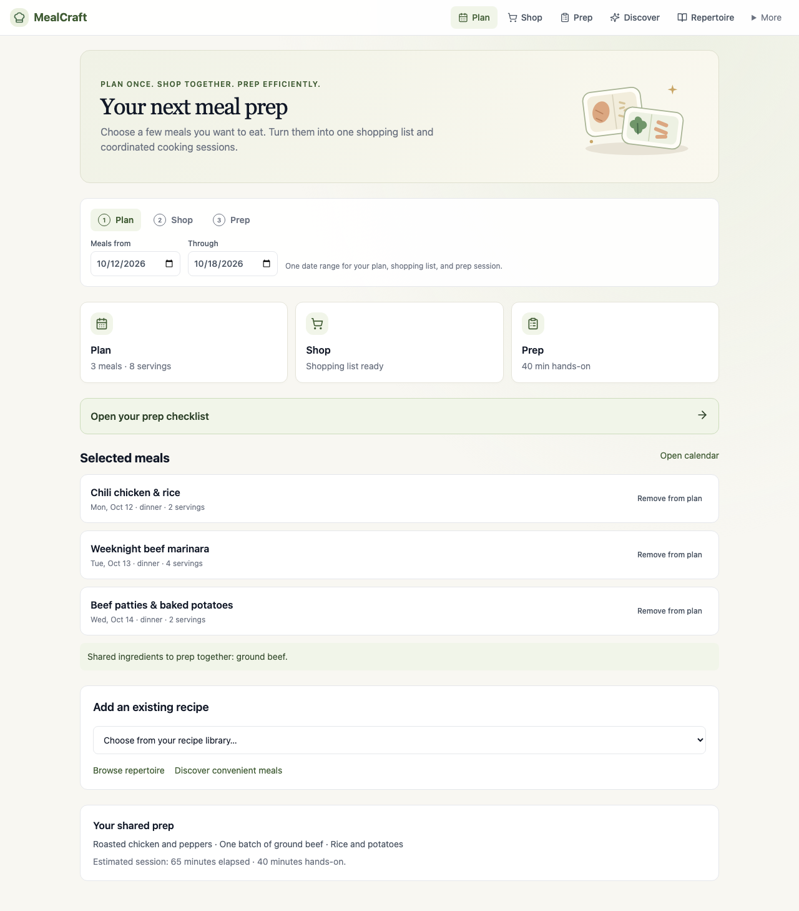
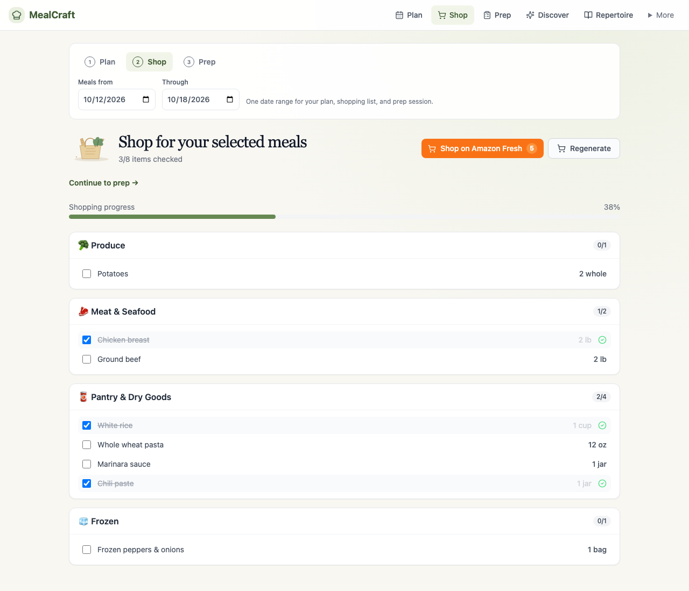
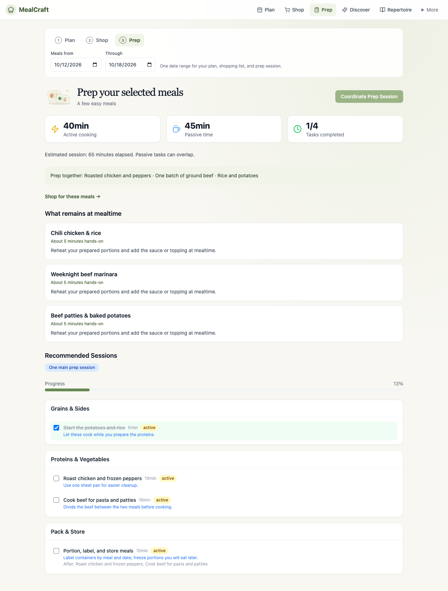
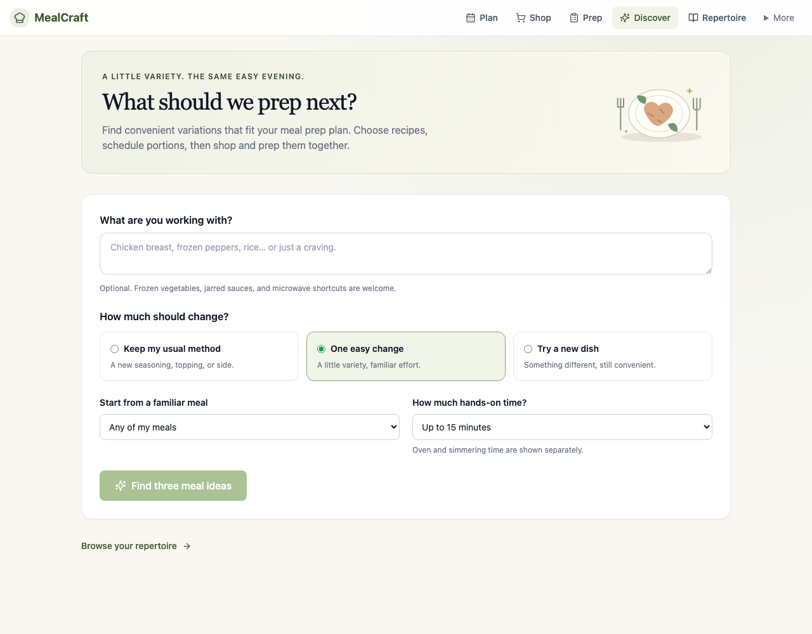
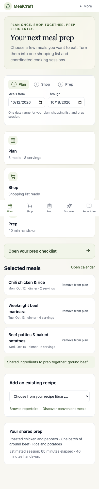

# 🍽 MealCraft

**Plan once. Shop together. Prep efficiently.** MealCraft helps you choose multiple meals,
combine their shopping requirements, and coordinate the cooking into a practical prep session.
Discover convenient variations on familiar dishes, save your favorites, and keep your repertoire fresh.
Generation runs through OpenRouter with your choice of tool-capable model.

## A look inside

The refreshed UI uses warm cream and sage colors, small kitchen illustrations, and a clear
**Plan → Shop → Prep** workflow. Screenshots below show sample meals and illustrative prep estimates.

### Plan your next prep



<table>
  <tr>
    <th>Shop for the whole selection</th>
    <th>Coordinate your prep</th>
  </tr>
  <tr>
    <td></td>
    <td></td>
  </tr>
</table>

<details>
  <summary>See Discover and the mobile layout</summary>

### Find a convenient variation



### Plan on your phone



</details>

## What it does

| Feature | Description |
|---------|-------------|
| **Plan** | Choose a shared date range and schedule recipes with the servings you want to prep. See selected meals, ingredient overlap, and shopping and prep readiness on the home screen. |
| **Shop** | Combine ingredient requirements for the selected meals and portions into a list organized by store section. Check items off as you shop. |
| **Prep** | Coordinate selected recipes into shared cooking tasks, with dependencies, hands-on and elapsed time estimates, portioning guidance, and the remaining work at mealtime. |
| **Discover** | Find three convenient ideas based on familiar meals, ingredients, scheduled meals, and a hands-on time budget. Generate a complete recipe when you choose one. |
| **Repertoire** | Save recipes, add meals you already cook, keep notes, and record whether you would make a dish again and whether it was easy enough. |
| **Calendar** | View and edit meal slots, mark meals as eating out or skipped, and generate ideas for unfilled slots without replacing chosen recipes. |
| **Recipe library** | Browse complete recipes with ingredients, steps, estimated nutrition, and scheduling controls. |
| **Leftovers** | Track remaining portions and get suggestions for using them. |
| **Settings** | Configure OpenRouter, default servings, difficulty, ingredient overlap, dietary restrictions, and cuisine preferences. |

---

## Stack

```
Frontend   React 18 + TypeScript + Vite + Tailwind CSS
Backend    Python 3.12 + FastAPI + SQLAlchemy 2.0 (async)
Database   SQLite (file-based, zero config)
AI         OpenRouter (configurable model) via function calling
```

---

## Getting started

### Prerequisites

- [Docker Desktop](https://www.docker.com/products/docker-desktop/) — easiest path
- Or: Python 3.12+ and Node 20+ for local dev

### With Docker

```bash
# From the repository root
cd mealcraft

cp .env.example .env
# Optionally add OPENROUTER_API_KEY to .env, or enter it in Settings after startup

docker compose up --build
```

Open **http://localhost:3080** — that's it.

### Local development

**Backend**

```bash
# From the repository root
cd mealcraft/backend
python -m venv .venv
source .venv/bin/activate  # macOS/Linux
# Windows PowerShell: .venv\Scripts\Activate.ps1
pip install -e .
alembic upgrade head
uvicorn app.main:app --reload --port 8000
```

**Frontend**

```bash
# In a second terminal, from the repository root
cd mealcraft/frontend
npm install
npm run dev        # → http://localhost:5173
```

Enter your OpenRouter key in **More → Settings** after startup, or set `OPENROUTER_API_KEY`
in the backend environment before launching the server.

The Vite dev server proxies `/api` to `localhost:8000` automatically.

---

## Plan, shop, and prep together

1. Open **Plan** and choose the dates you want to cover.
2. Add existing recipes or use **Discover** to find convenient variations. From a recipe, select its meal date and servings to prep.
3. Preview **Prep** for those dates: shared components, coordinated tasks, total hands-on and elapsed effort, portioning, and what remains at mealtime.
4. Open **Shop** to build a combined list scaled to the selected servings. Batch-assembly meals require a current prep session to translate components into raw groceries.
5. Shop and follow the prep checklist. Keep meal feedback and successful shortcuts in **Repertoire**.

Plan, Shop, and Prep share one date range. Changing recipes, dates, or portions marks existing outputs out of date.
Regenerated shopping lists retain checks only where the previous checked quantity still covers the new requirement.
The full calendar is linked from Plan; Settings, leftovers, and the recipe library are under More.

For existing local installations, run `alembic upgrade head` from `mealcraft/backend` before starting the server.
Docker runs migrations automatically. Migration 006 adds grocery coverage metadata and preserves existing plans and lists.

## Verification

From `mealcraft/backend`: `python -m unittest discover -s tests -v`.
From `mealcraft/frontend`: `npm run build`.
Tests use isolated databases and mocked model responses; live OpenRouter generation requires a configured key.

---

## Settings

Enter your OpenRouter API key and a model ID under **Settings → OpenRouter**, then click **Save**.
The model must support tool calling. New generation requests use saved changes immediately.
Keys are stored in the server SQLite database (including its backups), never returned by the settings API,
and can be replaced or removed in Settings. An environment key is used when no saved key exists.
The app starts without a key so you can configure it through Settings.

Saved settings apply to subsequent generation requests. Scheduled servings control how much you shop for and prep.

| Setting                  | Options                        | Effect                                                                                                                                                                |
|--------------------------|--------------------------------|-----------------------------------------------------------------------------------------------------------------------------------------------------------------------|
| **Recipe Complexity**    | Easy / Medium / Hard           | Sets the difficulty ceiling for all generated recipes                                                                                                                 |
| **Shopping List Scope**  | Variety / Balanced / Efficient | Controls ingredient overlap across meals — *Efficient* reuses the same proteins and grains heavily for a shorter list; *Variety* picks different ingredients each day |
| **Default Servings**     | 1–6 people                     | Scales all recipe quantities                                                                                                                                          |
| **Calorie Target**       | 1500–4000 kcal                 | Soft daily target used as a planning guide                                                                                                                            |
| **Cuisine Preferences**  | Free tags                      | e.g. Mediterranean, Japanese, Mexican                                                                                                                                 |
| **Dietary Restrictions** | Free tags                      | e.g. gluten-free, no pork, dairy-free                                                                                                                                 |

---

## Architecture

```
┌─────────────────┐     ┌─────────────────┐     ┌─────────────────┐
│   React SPA     │────▶│  FastAPI Server │────▶│  SQLite DB      │
│   (port 3080)   │ REST│  (port 8000)    │     │  data/mealcraft │
└─────────────────┘     └────────┬────────┘     └─────────────────┘
                                 │
                         ┌───────▼───────┐
                         │  OpenRouter   │
                         │  Chat API     │
                         └───────────────┘
```

**LLM integration** sends function schemas to OpenRouter and validates returned tool arguments with
Pydantic before using them. The model proposes recipes and prep instructions; the application handles
scheduling, portion scaling, shopping aggregation, saved feedback, and coverage checks locally.

Generation tasks include:

- `suggest_dinners` → three convenient ideas informed by repertoire and selected meals
- `generate_weekly_plan` → high-level meal concepts for the week
- `generate_recipe` → full recipe per meal slot (ingredients, steps, nutrition)
- `coordinate_meals` → a coordinated session for selected recipes, shared components, and mealtime finishes
- `optimize_prep_plan` → batch-component prep for the calendar planner
- `generate_grocery_list` → deduplicated, section-organized shopping list
- `suggest_leftover_use` → creative reuse suggestions

Cut-off completions automatically retry once with a larger output allowance. Partial recipe output is never saved.

**Real-time progress** during plan generation streams via SSE so you see each recipe being created as it happens.

---

## Project structure

```
mealcraft/
├── backend/
│   └── app/
│       ├── models/        # SQLAlchemy ORM models
│       ├── schemas/       # Pydantic request/response schemas
│       ├── routers/       # FastAPI route handlers
│       ├── services/      # Business logic (planner, optimizer, grocery)
│       └── llm/
│           ├── client.py  # OpenRouter API wrapper
│           ├── tools.py   # Function schema definitions
│           ├── schemas.py # Pydantic models for LLM output
│           └── prompts/   # Jinja2 prompt templates
├── frontend/
│   └── src/
│       ├── views/         # Page components
│       ├── components/    # Reusable UI
│       ├── hooks/         # React Query hooks, useSettings, useSSE
│       └── api/           # Typed fetch wrappers
└── docker-compose.yml
```

---

## Backup

For local development, app data lives in `mealcraft/backend/data/mealcraft.db`.
Stop the backend before copying it. Backups include any saved OpenRouter key.
Docker stores the database in the `mealcraft_data` volume.

```bash
cp mealcraft/backend/data/mealcraft.db mealcraft/backend/data/mealcraft.db.bak
```

---

## Environment variables

| Variable            | Default                                   | Description                       |
|---------------------|-------------------------------------------|-----------------------------------|
| `OPENROUTER_API_KEY` | optional | Server key fallback; alternatively enter a key in Settings |
| `OPENROUTER_MODEL` | `anthropic/claude-sonnet-4` | Default model; can be changed in Settings |
| `DATABASE_URL`      | `sqlite+aiosqlite:///./data/mealcraft.db` | SQLAlchemy connection string      |
| `CALORIE_TARGET`    | `2500`                                    | Default daily calorie target      |
| `MAX_DIFFICULTY`    | `medium`                                  | Default recipe difficulty ceiling |
| `LOG_LEVEL`         | `INFO`                                    | Uvicorn/app log level             |
