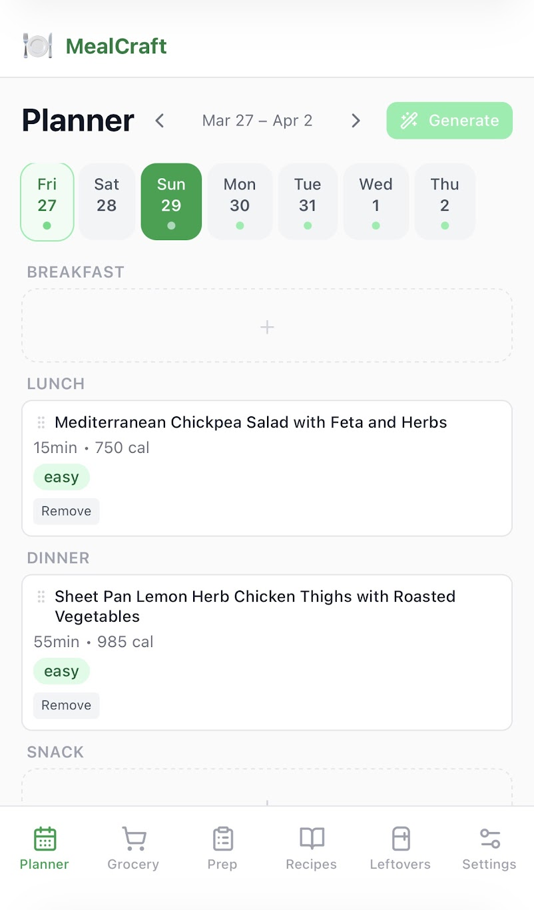
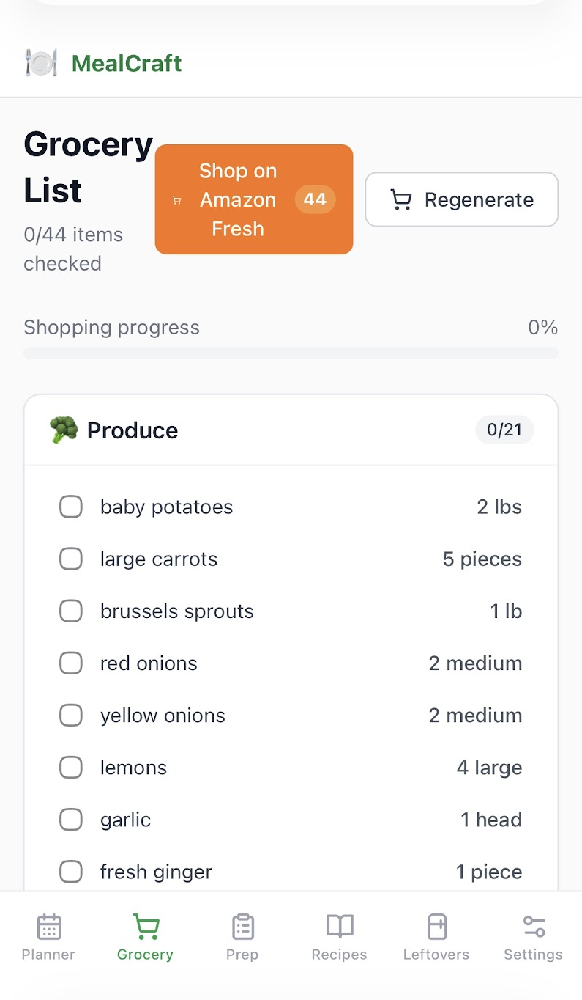
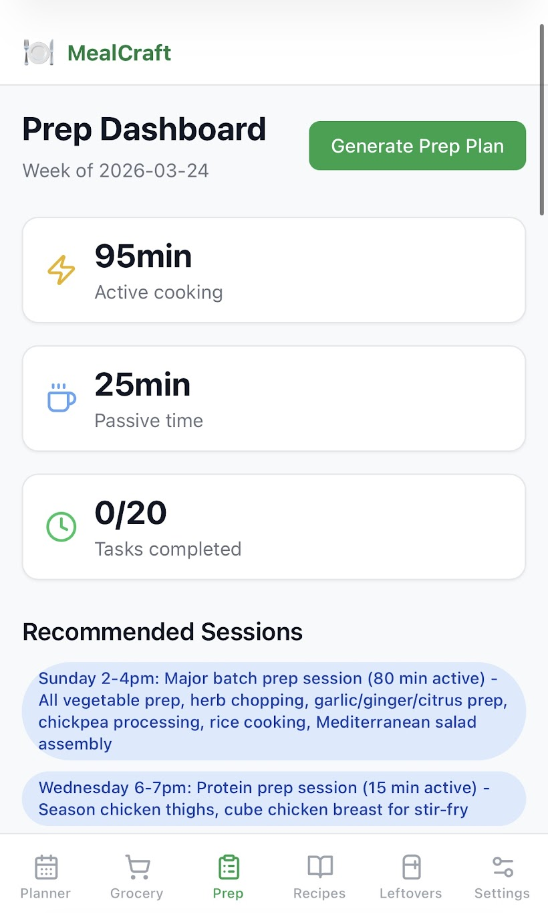
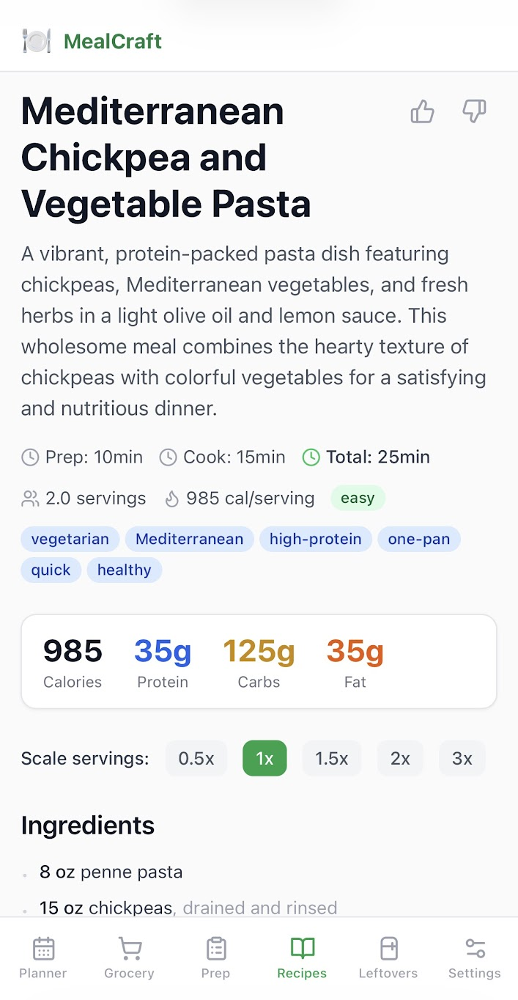

# 🍽 MealCraft

**AI-powered home cooking management.** MealCraft uses Claude to plan your week of meals, generate recipes, build a
smart grocery list, and help you turn leftovers into tomorrow's lunch — all optimized to minimize how much time you
spend in the kitchen.

---
<table>
  <tr>
    <td></td>
    <td></td>
    <td></td>
    <td></td>
  </tr>
</table>

## What it does

| Feature               | Description                                                                                                                                                               |
|-----------------------|---------------------------------------------------------------------------------------------------------------------------------------------------------------------------|
| **Weekly Planner**    | Generate a 7-day meal plan with breakfast, lunch, and dinner. Mark slots as eating out or skipped — the planner adjusts everything accordingly.                           |
| **Recipe Generation** | Every recipe is generated on the fly by Claude. Full ingredients, step-by-step instructions, estimated nutrition, and difficulty rating.                                  |
| **Grocery List**      | One-click consolidated shopping list organized by store section. Quantities are rounded to purchasable amounts. Check items off as you shop.                              |
| **Batch Prep Plan**   | Identifies shared components across the week (e.g. one pot of grains, one roasted protein) and groups them into 1–2 prep sessions.                                        |
| **Leftover Tracker**  | Log what you cooked and how much is left. Get AI suggestions for reusing leftovers in upcoming meals before they expire.                                                  |
| **Settings**          | Control recipe difficulty, ingredient overlap (short focused list vs. varied shopping), default servings, calorie targets, cuisine preferences, and dietary restrictions. |

---

## Stack

```
Frontend   React 18 + TypeScript + Vite + Tailwind CSS
Backend    Python 3.12 + FastAPI + SQLAlchemy 2.0 (async)
Database   SQLite (file-based, zero config)
AI         Anthropic Claude (claude-sonnet-4-20250514) via tool_use
```

---

## Getting started

### Prerequisites

- [Docker Desktop](https://www.docker.com/products/docker-desktop/) — easiest path
- Or: Python 3.12+ and Node 20+ for local dev

### With Docker

```bash
git clone <repo>
cd mealcraft

cp .env.example .env
# Edit .env and add your ANTHROPIC_API_KEY

docker compose up --build
```

Open **http://localhost:3080** — that's it.

### Local development

**Backend**

```bash
cd backend
python -m venv venv && venv\Scripts\activate   # Windows
pip install -e .
# Set env vars (or create a .env file in backend/)
set ANTHROPIC_API_KEY=sk-ant-...
mkdir data
uvicorn app.main:app --reload --port 8000
```

**Frontend**

```bash
cd frontend
npm install
npm run dev        # → http://localhost:5173
```

The Vite dev server proxies `/api` to `localhost:8000` automatically.

---

## How a typical week works

```
1. Planner → "Create Week"        Creates empty meal slots for the week
2. Planner → "Generate Plan"      Claude fills every slot with a recipe
                                   (~22 API calls, ~2 minutes)
3. Grocery → "Generate List"      Consolidated list by store section
4. Prep    → "Generate Prep Plan" Batched prep sessions to minimize daily cooking
5. Cook, check off grocery items, log leftovers as you go
```

---

## Settings

All settings are applied the next time you generate a plan.

| Setting                  | Options                        | Effect                                                                                                                                                                |
|--------------------------|--------------------------------|-----------------------------------------------------------------------------------------------------------------------------------------------------------------------|
| **Recipe Complexity**    | Easy / Medium / Hard           | Sets the difficulty ceiling for all generated recipes                                                                                                                 |
| **Shopping List Scope**  | Variety / Balanced / Efficient | Controls ingredient overlap across meals — *Efficient* reuses the same proteins and grains heavily for a shorter list; *Variety* picks different ingredients each day |
| **Default Servings**     | 1–6 people                     | Scales all recipe quantities                                                                                                                                          |
| **Calorie Target**       | 1500–4000 kcal                 | Soft daily target used as a planning guide                                                                                                                            |
| **Cuisine Preferences**  | Free tags                      | e.g. Mediterranean, Japanese, Mexican                                                                                                                                 |
| **Dietary Restrictions** | Free tags                      | e.g. gluten-free, no pork, dairy-free                                                                                                                                 |

---

## Architecture

```
┌─────────────────┐     ┌─────────────────┐     ┌─────────────────┐
│   React SPA     │────▶│  FastAPI Server │────▶│  SQLite DB      │
│   (port 3080)   │ REST│  (port 8000)    │     │  data/mealcraft │
└─────────────────┘     └────────┬────────┘     └─────────────────┘
                                 │
                         ┌───────▼───────┐
                         │  Anthropic    │
                         │  Claude API   │
                         └───────────────┘
```

**LLM integration** uses Claude's `tool_use` feature to enforce structured JSON output — no fragile regex parsing. Each
planning task is a separate API call with its own Pydantic schema:

- `generate_weekly_plan` → high-level meal concepts for the week
- `generate_recipe` → full recipe per meal slot (ingredients, steps, nutrition)
- `optimize_prep_plan` → batched prep tasks with timing
- `generate_grocery_list` → deduplicated, section-organized shopping list
- `suggest_leftover_use` → creative reuse suggestions

**Real-time progress** during plan generation streams via SSE so you see each recipe being created as it happens.

---

## Project structure

```
mealcraft/
├── backend/
│   └── app/
│       ├── models/        # SQLAlchemy ORM models
│       ├── schemas/       # Pydantic request/response schemas
│       ├── routers/       # FastAPI route handlers
│       ├── services/      # Business logic (planner, optimizer, grocery)
│       └── llm/
│           ├── client.py  # Anthropic API wrapper
│           ├── tools.py   # tool_use schema definitions
│           ├── schemas.py # Pydantic models for LLM output
│           └── prompts/   # Jinja2 prompt templates
├── frontend/
│   └── src/
│       ├── views/         # Page components
│       ├── components/    # Reusable UI
│       ├── hooks/         # React Query hooks, useSettings, useSSE
│       └── api/           # Typed fetch wrappers
└── docker-compose.yml
```

---

## Backup

All data lives in a single file: `backend/data/mealcraft.db`

```bash
cp backend/data/mealcraft.db backend/data/mealcraft.db.bak
```

---

## Environment variables

| Variable            | Default                                   | Description                       |
|---------------------|-------------------------------------------|-----------------------------------|
| `ANTHROPIC_API_KEY` | required                                  | Your Anthropic API key            |
| `DATABASE_URL`      | `sqlite+aiosqlite:///./data/mealcraft.db` | SQLAlchemy connection string      |
| `CALORIE_TARGET`    | `2500`                                    | Default daily calorie target      |
| `MAX_DIFFICULTY`    | `medium`                                  | Default recipe difficulty ceiling |
| `LOG_LEVEL`         | `INFO`                                    | Uvicorn/app log level             |
